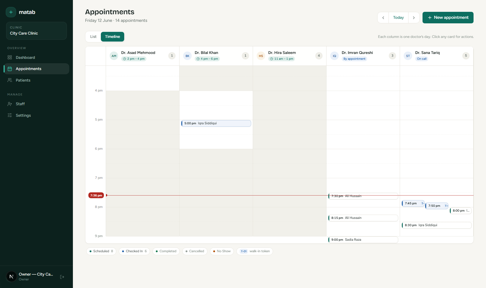

# matab — Clinic Management

[](LICENSE)
[](https://github.com/abdulrehmankz1/clinic-management/stargazers)
[](https://github.com/abdulrehmankz1/clinic-management/network/members)

A multi-tenant **clinic management** system built with **Payload CMS 3**, **Next.js 16**
and **MongoDB**. Many clinics share one deployment, but each clinic sees only its own
data — built around one non-negotiable rule: **a clinic can never see or touch another
clinic's data.** v1 ships the multi-tenant core (staff & roles, patients, appointments
with a double-booking guard, walk-in tokens, dashboard); **v2 closes the clinical loop** —
visits & prescriptions, billing with payments, printable prescription & receipt, a merged
patient timeline and owner revenue reporting; **v3 turns it into a real SaaS** — self-serve
clinic signup, plans & usage limits with an upgrade workflow, timezone-aware reminders,
and an append-only audit log.

> ⭐ **Like this project?** Give it a star and feel free to fork it — it really helps and
> keeps the project going!



## 🎬 Demo — owner walkthrough

A single end-to-end run as a clinic **owner**, covering the everyday front-desk flow:
booking three ways (scheduled, walk-in, and a brand-new patient added inline), seeing
where bookings land on the day view, registering a patient, adding a doctor, and reviewing
clinic settings.


<sub>▶ Full quality: <a href="demo-videos/owner-full-walkthrough.mp4">watch the MP4</a></sub>

**What it shows**

- **Booking, three ways** — a scheduled (online) appointment for an existing patient, a
  **walk-in** that gets a queue token, and a brand-new patient added inline while booking.
- **Where they land** — each booking appears on the per-doctor **day view** timeline.
- **Patients** — searchable directory + registering a new patient with a full medical
  record (MRN auto-assigned).
- **Staff** — adding a new doctor with specialty, fee and weekly availability.
- **Settings** — clinic profile, working hours, currency & timezone.

## 🎬 Demo — v3 reminders

The v3 reminder flow: a per-appointment **WhatsApp reminder** sent straight from the day
view (a `wa.me` deep link with the message prefilled — zero API cost), and the
**daily digest email** a clinic owner receives at 7 am *their clinic's* local time.


<sub>▶ Full quality: <a href="demo-videos/reminders-flow.mp4">watch the MP4</a></sub>

## The problem

Small clinics — one to a few doctors, a receptionist — still run on paper appointment
registers, patient histories in loose files, and a cash drawer. Existing hospital systems
are expensive, complex, and assume IT staff. There's a gap for a cheap, simple,
multi-clinic tool a receptionist can learn in half an hour.

## ✨ Features (v1)

- **Multi-tenancy** — one app, one database, fully isolated clinics ("tenants").
- **Auth & roles** — `superAdmin` (platform), and per-clinic `owner`, `doctor`,
  `receptionist`, each with its own access.
- **Patients** — register/search by name, phone or MRN; auto per-clinic patient numbers
  (`P-0001`); allergy banner; same-number dedupe warning (families share phones).
- **Appointments** — a day view with two modes: a **queue List** (time-ordered, one-tap
  *Check in / Complete* — built for non-technical front-desk staff) and a per-doctor
  **Timeline** (availability windows, now-line, side-by-side lanes for overlapping slots).
  Status flow (`scheduled → checked-in → completed / cancelled / no-show`) and a
  **double-booking guard** that rejects overlapping slots.
- **Doctor availability** — each doctor is `regular` (set weekdays + a daily window, e.g.
  Mon/Wed/Fri 4–6pm), `on-call` (any time), or `by-appointment` (visiting surgeon — hidden
  from the auto finder). Bookings are blocked outside a regular doctor's window, and a
  **"which doctors are free at this time?"** finder powers the call-in flow.
- **Walk-ins** — first-come-first-serve with an auto **token number** (`T-01`, `T-02`…)
  per clinic per day, shown on the Day Rail.
- **Dashboard** — today's KPIs, a 14-day activity chart, up-next list, doctors on duty,
  quick actions and recently registered patients.
- **Super admin console** — create clinics (owner created atomically), suspend/reactivate.
- **UI** — teal "clinical calm" design system on Tailwind v4 + shadcn/ui; dark sidebar app
  chrome; landing page with one-click demo logins; spinner feedback on every pending action.

## 🩺 Features (v2 — the clinical loop)

The loop **appointment → consultation → prescription → invoice → payment**, end to end.

- **Visits & prescriptions** — a doctor records a visit from the day view (symptoms,
  diagnosis, vitals, free-text prescription rows, follow-up). One appointment = one visit
  (unique-index enforced), and recording it auto-completes the appointment. Patient/doctor
  are denormalised from the appointment so timeline queries stay simple.
- **Billing** — invoices with line items (consultation fee pre-filled from the doctor's
  profile, editable), payments with method & date, and **derived** totals: `totalAmount`,
  `amountPaid`, `balanceDue` and `paymentStatus` (`unpaid → partial → paid`) are always
  computed in a hook — client-sent values are ignored. Overpayment is rejected, line items
  lock after the first payment, and only an **owner** can void (with a reason); voided
  invoices are frozen and excluded from revenue.
- **Currency snapshot** — each invoice stores the clinic's currency at create time, so a
  later settings change never rewrites historical amounts.
- **Printable documents** — dedicated, tenant-scoped print routes for an **A5 prescription**
  (clinic letterhead from the tenant profile) and a **receipt**, driven purely by
  `@media print` CSS and `window.print()` — no PDF library.
- **Patient timeline** — a merged, chronological feed (visits, invoices, and only
  cancelled/no-show appointments — completed ones surface through their visit), with
  Appointments and Invoices as sibling tabs. Each source is a DB-side query, never load-all.
- **Owner revenue dashboard** — revenue today / this month (payments-based, voided excluded),
  a 14-day revenue chart, and an outstanding-balances list (top unpaid/partial invoices).
- **Clinic settings edit** — the owner edits the clinic profile, hours, slot length, currency
  and timezone (field-level access: `slug`/`status` stay super-admin only).

## 🏢 Features (v3 — real SaaS mechanics)

Matab stops being an attended demo and starts behaving like a product: clinics sign
themselves up, plans limit usage, the system communicates, and every sensitive action
leaves a record.

- **Self-serve signup** — a public `/signup` creates the clinic + owner + sample data
  **atomically in one transaction** (any failure rolls everything back). Slugs are
  auto-generated with `-2`/`-3` suffixes on collision; a honeypot field, a minimum-fill-time
  check and per-IP rate limiting (3/hour) keep bots out. New clinics queue as **pending**
  until the super admin approves them, and the first login gets a 3-step welcome checklist
  derived from live counts — no extra state stored.
- **Plans & limits** — `free` (1 doctor, 50 patients) / `clinic` (5 doctors) / `plus`
  (unlimited), defined in code (`src/lib/plans.ts`) and enforced in `beforeChange` hooks
  with a clear `PLAN_LIMIT` error. **Downgrade-safe:** if a plan shrinks below current
  usage, existing data stays readable and editable — only *new* creates are blocked.
  Deactivated doctors don't count toward the limit.
- **Upgrade workflow (billing intentionally stubbed)** — an owner-facing `/dashboard/plan`
  page with usage bars and plan cards; "Request upgrade" with an optional note; a
  super-admin approve/decline queue on `/super`. The enforcement and approval workflow are
  real — the payment gateway is a swappable last mile.
- **Audit log** — an append-only `auditLogs` collection written **only from server-side
  hooks**: REST create/update/delete is denied for everyone, super admin included.
  Owners get a `/dashboard/activity` page with action filters; the super console gets a
  per-tenant activity peek. An audit-write failure never breaks the business operation.
- **Reminders** — a **timezone-aware daily digest email** (Resend) sent from an hourly
  Vercel cron guarded by `CRON_SECRET`, plus a per-appointment **WhatsApp reminder**
  button — a `wa.me` deep link with the message prefilled. Zero API cost, works anywhere
  WhatsApp does.
- **Tenant suspension UX** — suspended clinics are blocked at login, and already-active
  sessions hit a full-screen stop state (no data rendered). Suspend/reactivate are audited.

## ⏰ One cron, every timezone

Each clinic sets its own timezone, so "email the owner at 7 am" can't be a single
scheduled job. Instead the digest cron runs **hourly**, and each run sends only to
clinics whose local time is currently 7 — a clinic in Karachi and one in London both get
their digest at their own 7 am from the same cron. One clinic's email failure is logged
and skipped, never crashing the loop; without `RESEND_API_KEY` the whole feature quietly
switches off (graceful degradation).

## 🔐 Multi-tenancy design

The tenant wall lives in **one place** — access-control functions (`src/access/`) that
return a Mongo `where` constraint Payload merges into every query, e.g.
`{ tenant: { equals: user.tenant } }`. It is **deny-by-default**: any request that can't
positively determine a tenant returns `false`.

- **Set it, don't trust it** — a `beforeChange` hook force-sets `tenant` from the
  logged-in user; whatever the client sends is overwritten. `tenant` is immutable after create.
- **The client never decides scoping** — tenant is always derived server-side.
- **Custom, not the plugin** — a ~150-line set of access helpers instead of the official
  multi-tenant plugin, so every line is explainable and there's no version coupling.
- **Proven by tests** — `tests/int/isolation.int.spec.ts` asserts cross-tenant
  reads/writes fail and that planted foreign tenants are force-corrected.

## ⏱️ Double-booking guard

Two appointments for the same doctor conflict iff
`existing.start < new.end && existing.end > new.start` (touching edges don't conflict).
The check runs **inside the request's MongoDB transaction**, and a **partial unique index**
on `(tenant, doctor, start)` (active statuses only) is the deterministic backstop so two
simultaneous bookings for the same slot can't both win — one aborts. A race test
(`Promise.all` of two identical bookings) proves exactly one succeeds.

## 🌍 Market-agnostic by design

Nothing region-specific is hardcoded. Each clinic has its own **currency** and **timezone**
as settings (defaults `PKR` / `Asia/Karachi`). All money flows through
`formatMoney(amount, tenant)` and all times through `formatTime(date, tenant)`. Pakistan is
the launch market, not a limitation.

## 🧱 Tech stack

| Layer | Choice |
|---|---|
| CMS / API / Auth | Payload CMS 3 |
| Web | Next.js 16 (App Router) + React 19 |
| DB | MongoDB (replica set — for transactions) |
| Styling | Tailwind CSS v4 + shadcn/ui (Base UI) + lucide-react |
| Tests | Vitest (Payload Local API integration tests) |

## 🚀 Getting started

```bash
pnpm install
cp .env.example .env          # then fill PAYLOAD_SECRET
docker compose up -d          # MongoDB as a single-node replica set (rs0)
pnpm seed                     # 3 demo clinics, staff, patients, appointments, visits, invoices & payments
pnpm dev                      # http://localhost:3000
```

> **Replica set is required.** The booking guard uses transactions, which only work on a
> replica set. `docker compose up -d` starts a single-node `rs0` and initializes it
> automatically. A standalone mongo silently makes transactions a no-op.

> **Email is optional.** Leave `RESEND_API_KEY` empty and the digest/notification emails
> quietly turn off — everything else works. `CRON_SECRET` guards `/api/cron/*` in
> production (the Vercel cron schedule lives in `vercel.json`).

### Demo logins (password: `password123`)

| Role | Email |
|---|---|
| Super Admin | `super@clinic.app` |
| Owner — City Care | `owner@city.app` |
| Receptionist — City Care | `reception@city.app` |
| Doctor — City Care | `doctor1@city.app` |
| Owner — Shifa | `owner@shifa.app` |

Log in as City Care, then as Shifa — the data is completely different. That's the tenant wall.

Or skip the table entirely: hit **`/signup`** and onboard your own clinic — it lands as
*pending* in the super-admin console, gets approved, and you're running a clinic with
sample data in under a minute.

## ✅ Tests

```bash
pnpm test                     # 80 integration tests: isolation, booking guard, availability, walk-in tokens,
                              # billing & visits, signup transaction, plan limits, upgrade workflow,
                              # audit immutability & the digest cron (auth + timezone gating)
```

> Heads-up: the test suite currently shares the dev database and wipes it — run
> `pnpm seed` afterwards to restore the demo data.

## 📁 Project structure

```
src/
  access/         # the tenant wall — isSuperAdmin, tenantScoped, field-level rules, denyAll (audit)
  app/(frontend)/ # landing, login, signup, dashboard/* (appointments, patients, visits, invoices,
                  #   staff, settings, plan, activity), print/*, super
  app/(payload)/  # admin panel & REST/GraphQL API (super admin only)
  app/api/cron/   # daily-digest route (CRON_SECRET-guarded, hourly via vercel.json)
  collections/    # Tenants, Users, Patients, Appointments, Visits, Invoices, AuditLogs
  components/     # DayRail, BookingForm, StaffManager, SuperConsole, PlanPanel, BarChart, RevenueChart, Sidebar, ui/
  hooks/          # forceTenant (set-it-don't-trust-it), planLimit, audit wiring
  lib/            # booking.ts, availability.ts, reports.ts, timeline.ts, plans.ts, signup.ts,
                  #   audit.ts, digest.ts, email.ts, whatsapp.ts, rateLimit.ts, format.ts, constants.ts
  seed.ts
  payload.config.ts
public/images/    # landing/login photography (Unsplash) + product shot
tests/int/        # isolation, booking, overlap, availability, walk-in, billing, reports,
                  #   signup, plans, upgrade, audit & digest suites
```

## 🗺️ Roadmap

- **v1 — Multi-tenant foundation** ✅ — tenancy, roles, patients, appointments, dashboard.
- **v2 — The clinical loop** ✅ — visits & prescriptions, billing & payments, printable
  prescription/receipt, patient timeline, owner revenue reporting, settings edit.
- **v3 — Real SaaS mechanics** ✅ — self-serve signup with approval queue, plans & limits
  with an upgrade workflow, timezone-aware reminder digests + WhatsApp deep links,
  append-only audit log, suspension UX.

## 🤝 Contributing

Contributions, issues and feature requests are welcome! The usual open-source flow:

1. **Fork** the repository — <https://github.com/abdulrehmankz1/clinic-management>
2. Create your feature branch — `git checkout -b feature/amazing-feature`
3. Commit your changes — `git commit -m "feat: add amazing feature"`
4. Push to the branch — `git push origin feature/amazing-feature`
5. Open a **Pull Request**

If you find this project useful, please ⭐ **star the repo** and consider **forking** it —
it helps others discover the project and motivates further development.

## 🙌 Credits & Attribution

Built and maintained by **Abdul Rehman** ([@abdulrehmankz1](https://github.com/abdulrehmankz1)).

You are free to use, modify and distribute this project under the terms of the MIT License.
If you use it in your own work — whether a fork, a derivative, or as a learning reference —
**please give credit** by linking back to the original repository:

> Based on [matab — Clinic Management](https://github.com/abdulrehmankz1/clinic-management)
> by [Abdul Rehman](https://github.com/abdulrehmankz1).

## 📜 License

This project is licensed under the **MIT License** — see the [LICENSE](LICENSE) file for
details. You can use it commercially and privately, modify it and distribute it; just keep
the copyright and license notice intact.
